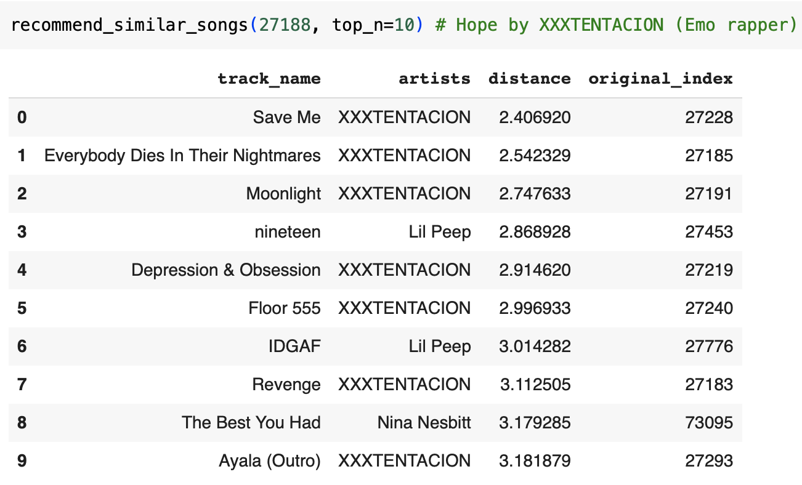
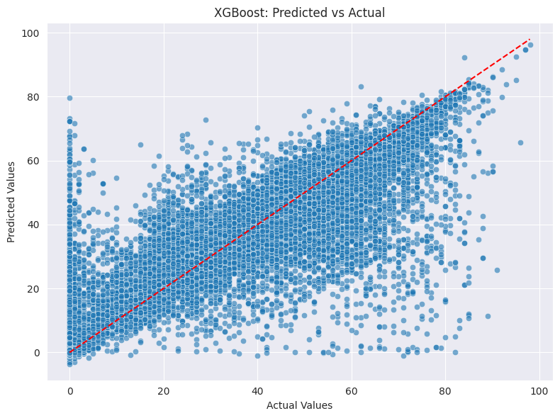
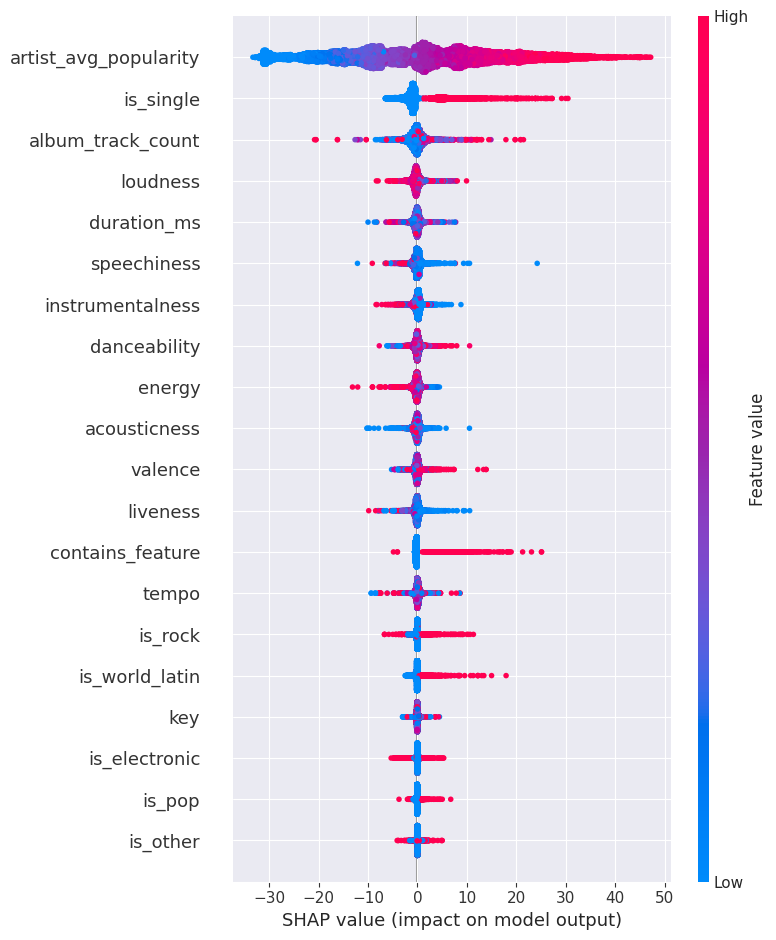
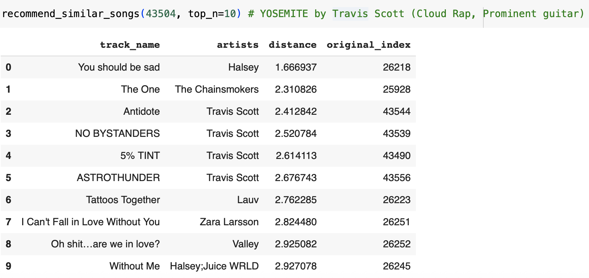
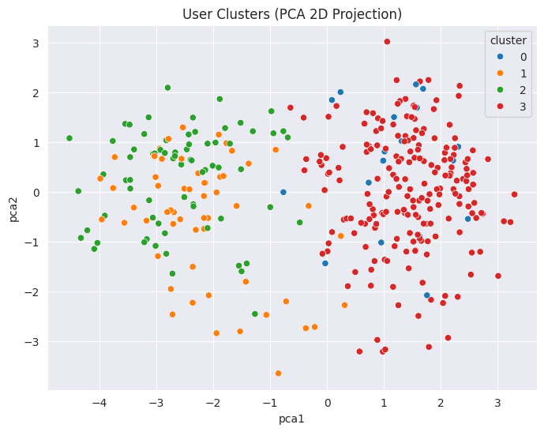
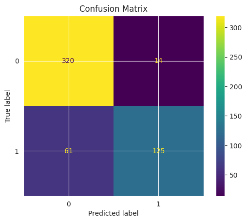

# Spotify-Track-Recommender-System-and-Popularity-Regression

  
  

## Description
With millions of tracks available on Spotify, music discovery is a non-trivial challenge. This project tackles that challenge by:

- Predicting song popularity using machine learning
- Recommending similar songs based on audio features and metadata

We use Spotify’s track-level and user-level datasets to power both a **content-based recommender system** and a **popularity prediction model**, supported by clustering and interpretability techniques.

## Dataset

This project utilizes two publicly available Spotify-related datasets sourced from Kaggle, along with extensive feature engineering for downstream analysis and recommendation.

### 🎵 1. Spotify Tracks Dataset  
📎 [Spotify Tracks Dataset](https://www.kaggle.com/datasets/maharshipandya/-spotify-tracks-dataset/data)

This dataset includes detailed audio features and metadata for over **160,000 tracks** streamed on Spotify between 1921 and 2020. It forms the foundation for our popularity prediction and content-based recommendation system.

#### Key Features:
- **Audio Features:** `danceability`, `energy`, `key`, `loudness`, `mode`, `speechiness`, `acousticness`, `instrumentalness`, `liveness`, `valence`, `tempo`, `duration_ms`, `time_signature`
- **Metadata:** `track_name`, `artist_name`, `album_name`, `explicit`, `release_date`, `popularity`, `genre`

#### Feature Engineering:
- **Text Parsing:** Extracted binary flags from `track_name` (e.g., `contains_remix`, `contains_feature`)
- **Track Identity:** Created `is_single` by comparing `track_name` and `album_name`
- **Genre Super-Categories:** Consolidated sub-genres into broad flags (e.g., `is_pop`, `is_rock`, `is_metal`, `is_world_latin`)
- **Artist-Level Stats:** Aggregated popularity at the artist level (`artist_avg_popularity`)
- **Standardization:** Applied `StandardScaler` to numerical features for consistency across models
- **Cleaning:** Dropped rows with missing values and removed duplicate entries by `track_name`, `artist_name`, and `duration_ms`

These transformations ensured that the dataset was structured and optimized for both regression and similarity-based algorithms.

---

### 👥 2. Spotify User Behavior Dataset  
📎 [Spotify User Behavior Dataset](https://www.kaggle.com/datasets/meeraajayakumar/spotify-user-behavior-dataset)

This synthetic dataset simulates the listening habits of **1,000 Spotify users**, designed to model subscription behavior and usage patterns. It supports our user segmentation and premium subscription prediction analysis.

####  Key Features:
- **User Demographics:** `user_id`, `gender`, `age`
- **Behavioral Patterns:**
  - Listening time (`time_of_day`)
  - Preferred device (`device`)
  - Favorite genre and mood
  - Discovery method (`method`) – e.g., playlist, radio, recommendation
  - Podcast consumption (`podcast_freq`)
- **Target Variable:** `subscription_type` – Free vs Premium

---

## Approaches

### A. Popularity Prediction

We used **XGBoost Regression** to predict the `popularity` score of tracks, on a scale from 0 to 100, based on engineered features.

- **Preprocessing:** De-duplication, imputation, one-hot encoding, and scaling.
- **Model:** XGBoost — chosen for its performance on structured data.
- **Interpretability:** Used **SHAP (Shapley Additive Explanations)** to identify the most influential features.

**Key Predictive Features:**
- `artist_avg_popularity`
- `is_single`
- `loudness`
- `album_track_count`

<table align="center">
  <tr>
    <td align="center">
       
      <strong>Predicted vs Actual (XGBoost)</strong>
    </td>
    <td align="center">
       
      <strong>SHAP Feature Importance</strong>
    </td>
  </tr>
</table>

### B. Content-Based Recommender System

Built using the **K-Nearest Neighbors (KNN)** algorithm to find musically similar tracks.

- Each song is represented as a feature vector.
- **Similarity Metric:** Euclidean distance between songs.
- Given a seed track, the system finds and returns its top K similar songs based on audio properties and metadata.

**Example:**  

### C. User-Level Analysis (Bonus)

Although not central to the recommender, we analyzed a separate **Spotify User Behavior** dataset to:

- **Predict Premium Subscription** — using XGBoost
- **Cluster Users** — via K-Means into 4 behavior-based groups:
  - Relaxation-Focused Night Listeners
  - Radio + Podcast Explorers
  - Health & Fitness Listeners
  - Power Listeners on Mobile
 

These user profiles support future enhancements like hybrid recommenders.

---

## Evaluation Metrics

| Task                          | Metric        | Value    |
|-------------------------------|---------------|----------|
| Popularity Regression         | RMSE          | 11.55    |
|                               | R² Score      | 0.730    |
| Premium Subscription (User)   | Accuracy      | 0.856    |
| Classification                | Precision     | 0.899    |
|                               | Recall        | 0.672    |
|                               | F1 Score      | 0.769    |
| Recommender Quality           | Qualitative   | Stylistic similarity confirmed via examples |

